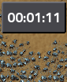

# Factorio Mod GameClock

This mod adds a simple clock into the game. The clock displays the time spent in the current game.

There is also an in game Chronometer that can be start (left click), stop (left-click) and reset (right click).

## Pictures

The mod during the game.

The mod with active Chronometer.

## Changelog

### Version 16.1.0

* add the chronometer feature.
* add the Shift+C hotkey to toggle the chronometer display.

### Version 16.0.1

* first version of the mod
* add a simple clock on the upper button flow of the screen

## Roadmap

### Future and Ideas

* add a timer button
* When timer is below X% total time color in orange
* When timer is below Y% total time color in red
* The timer can be disabled with an option

## How to contribute

If you want to contribute feel free to create a [pull request](https://github.com/Tarrke/factorio-clock/compare) (with new translations for example).

Otherwise you can create an [issue](https://github.com/Tarrke/factorio-clock/issues/new) if you find a bug or have an idea for a feature.

If you don't have a github account feel free to contact us via mail at tarrke+factorio (at) gmail.com.

## Credits

Thanks to [JonasJurczok](https://github.com/JonasJurczok) for inspiring me with his [TodoList](https://github.com/JonasJurczok/factorio-todo-list) mod and huge help correcting all my silly mistakes. Without him I may never have release this mod.
